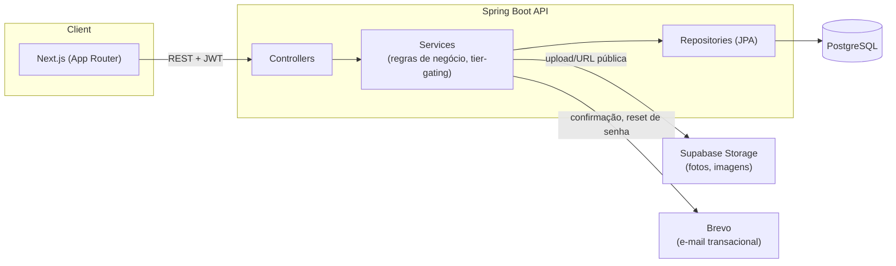

# LinkPet

Uma página de links personalizável (estilo Linktree) com um pet virtual que evolui conforme a página recebe engajamento. Full-stack, com frontend e backend completamente desacoplados.

Frontend na Vercel · Backend no Render · Banco no Supabase

---

## Sobre o projeto

O LinkPet deixa qualquer pessoa reunir todos os seus links importantes em uma única página pública (`linkpet.app/seu-usuario`), com um nível de customização bem maior do que o típico "lista de botões":

- Links organizados em **grupos** reordenáveis, com layout em lista ou em grid de ícones
- Blocos de **texto** e **imagem**, além do link tradicional
- **Embeds nativos** de YouTube, Spotify e Instagram — o link vira o player/post embutido na página
- Até 3 links **em destaque**, fixados no topo, lado a lado, com reordenação
- **Customização** de tema, cor, fonte e formato dos botões
- **Captura de contato** (e-mail/WhatsApp) direto na página pública
- **Analytics** de cliques, com origem, dispositivo e país de quem acessou
- Um **pet virtual** por usuário, que ganha XP e sobe de nível com curtidas na página, com acessórios e badges desbloqueáveis
- Planos por camada: Free, Premium, Empresa, Colaborador e Desenvolvedor, com features gradualmente desbloqueadas

## Arquitetura

Frontend e backend são dois projetos separados, comunicando só por HTTP/JSON — o backend é uma API de verdade, sem acoplamento com o Next.js.



| Camada | Stack |
|---|---|
| Frontend | Next.js 16 (App Router) · React 19 · TypeScript · Tailwind CSS · next-intl (pt-BR/en) |
| Backend | Spring Boot 3 · Java 17 · Spring Security + JWT · Spring Data JPA · Flyway |
| Banco de dados | PostgreSQL, com todo o schema versionado em migrations Flyway |
| Armazenamento | Supabase Storage (fotos de perfil, imagens de blocos) |
| E-mail transacional | Brevo (confirmação de conta, redefinição de senha) |
| Deploy | Vercel (frontend) · Render (backend) · Supabase (banco + storage) |

Algumas decisões de arquitetura que valem citar:

- **Backend como API isolada**, não API routes do Next — mantém as regras de negócio testáveis e reutilizáveis independente do cliente.
- **Regras de negócio centralizadas na camada de serviço**, não no controller nem no frontend — por exemplo, `UsuarioService.ehPremium()` decide quem tem acesso a features pagas, e é injetado nos outros serviços em vez de duplicar a lógica de plano em cada lugar que precisa checar.
- **Schema 100% versionado**: cada mudança de banco é uma migration Flyway numerada (`V1` a `V20` até agora), nunca uma alteração manual.
- **Mensagens de erro localizadas**: toda validação de negócio devolve uma chave de erro resolvida via `Accept-Language`, com pt-BR como padrão e inglês como alternativa.

## Estrutura do repositório

```
lkclone/
├── be/   # API Spring Boot
│   └── src/main/java/com/lkclone/be/
│       ├── controller/   # endpoints REST
│       ├── service/      # regras de negócio
│       ├── model/        # entidades JPA
│       └── dto/          # contratos de entrada/saída
└── fe/   # Frontend Next.js
    └── app/[locale]/
        ├── [username]/   # página pública
        ├── dashboard/    # área logada
        ├── login, cadastro, ...
```

## Rodando localmente

Pré-requisitos: Node 20+, Java 17+, PostgreSQL.

**Backend**

```bash
cd be
createdb lkclone   # ou equivalente no seu client de Postgres
JWT_SECRET=$(openssl rand -hex 32) ./mvnw spring-boot:run
```

As migrations do Flyway rodam automaticamente na subida. Variáveis opcionais (`SUPABASE_*`, `BREVO_*`) habilitam upload de imagem e envio de e-mail — sem elas, a API sobe normalmente, só essas features específicas ficam indisponíveis.

**Frontend**

```bash
cd fe
npm install
cp .env.local.example .env.local
npm run dev
```

Abre em `http://localhost:3000`.

## API

Alguns grupos de endpoints da API (prefixo `/usuarios` salvo indicação):

| Recurso | Exemplos |
|---|---|
| Contas | `POST /usuarios`, `POST /usuarios/login`, `GET /usuarios/me` |
| Links | `POST /{id}/links`, `PATCH /{id}/links/{linkId}`, `PATCH /links/destaque/reordenar` |
| Grupos | `POST /{id}/grupos`, `PATCH /{id}/grupos/{grupoId}/layout` |
| Aparência | `PATCH /{id}/tema`, `PATCH /{id}/aparencia` |
| Analytics | `GET /{id}/analytics` |
| Pet | `POST /p/{username}/pet/like` |
| Página pública | `GET /p/{username}` |

## Licença

Projeto pessoal, sem licença de distribuição definida ainda.
